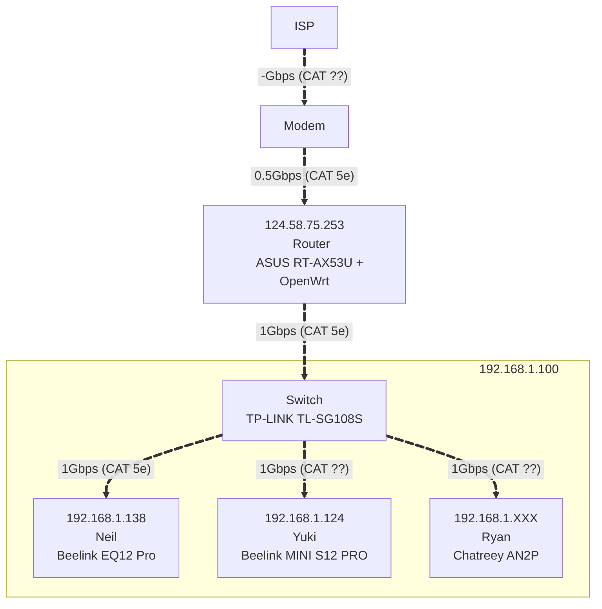

# Homelab

## Network Architecture

```mermaid
flowchart TD
    isp["ISP"]
    modem["Modem"]
    router["124.58.75.253
    Router
    ASUS RT-AX53U + OpenWrt"]
    switch["Switch
    TP-LINK TL-SG108S"]
    neil["192.168.1.138
    Neil
    Beelink EQ12 Pro"]
    yuki["192.168.1.124
    Yuki
    Beelink MINI S12 PRO"]
    ryan["192.168.1.XXX
    Ryan
    Chatreey AN2P"]

    isp    i2m@==>|"&nbsp;-Gbps (CAT ??)&nbsp;"| modem
    modem  m2r@==>|"&nbsp;0.5Gbps (CAT 5e)&nbsp;"| router
    router r2s@==>|"&nbsp;1Gbps (CAT 5e)&nbsp;"| switch
    subgraph "&nbsp;&nbsp;&nbsp;&nbsp;&nbsp;&nbsp;&nbsp;&nbsp;&nbsp;&nbsp;&nbsp;&nbsp;&nbsp;&nbsp;&nbsp;&nbsp;&nbsp;&nbsp;&nbsp;&nbsp;&nbsp;&nbsp;&nbsp;&nbsp;&nbsp;&nbsp;&nbsp;&nbsp;&nbsp;&nbsp;&nbsp;&nbsp;&nbsp;&nbsp;&nbsp;&nbsp;&nbsp;&nbsp;&nbsp;&nbsp;&nbsp;&nbsp;&nbsp;&nbsp;&nbsp;&nbsp;&nbsp;&nbsp;&nbsp;&nbsp;&nbsp;&nbsp;&nbsp;&nbsp;&nbsp;&nbsp;&nbsp;&nbsp;&nbsp;&nbsp;&nbsp;&nbsp;&nbsp;&nbsp;&nbsp;&nbsp;&nbsp;&nbsp;&nbsp;&nbsp;&nbsp;&nbsp;&nbsp;&nbsp;&nbsp;&nbsp;&nbsp;&nbsp;&nbsp;&nbsp;&nbsp;&nbsp;&nbsp;&nbsp;&nbsp;&nbsp;&nbsp;&nbsp;&nbsp;&nbsp;&nbsp;&nbsp;&nbsp;&nbsp;&nbsp;&nbsp;&nbsp;&nbsp;&nbsp;&nbsp;&nbsp;&nbsp;&nbsp;&nbsp;&nbsp;&nbsp;&nbsp;&nbsp;&nbsp;&nbsp;&nbsp;&nbsp;&nbsp;&nbsp;&nbsp;&nbsp;&nbsp;&nbsp;&nbsp;&nbsp;&nbsp;&nbsp;&nbsp;&nbsp;&nbsp;&nbsp;&nbsp;&nbsp;192.168.1.100"
        switch s21@==>|"&nbsp;1Gbps (CAT 5e)&nbsp;"| neil
        switch s22@==>|"&nbsp;1Gbps (CAT ??)&nbsp;"| yuki
        switch s23@==>|"&nbsp;1Gbps (CAT ??)&nbsp;"| ryan
    end
    i2m@{ animate: true }
    m2r@{ animate: true }
    r2s@{ animate: true }
    s21@{ animate: true }
    s22@{ animate: true }
    s23@{ animate: true }
```
